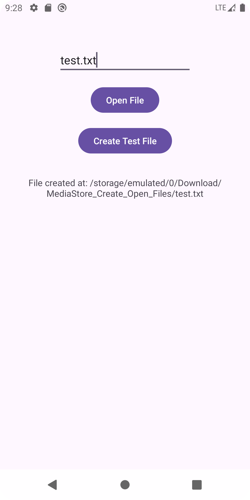

# Android_MediaStore_Java

**Save, Create, and Read Files in Android Java with MediaStore**

This repository is an example Android application that demonstrates how to use MediaStore in Android 10+ (API level 29 and above) without requiring any Android permissions. The app allows you to:  

- Save files  
- Create files  
- Read files  

All files are managed in the `/Download/appName` directory.  

---

## Features  

1. **Save Files**  
   Demonstrates how to save files to the MediaStore in a storage environment.  

2. **Create Files**  
   Shows how to create new files directly in the `/Download/appName` directory.  

3. **Read Files**  
   Explains how to access and read files stored in the `/Download/appName`.

---

## Requirements  

- **Minimum Android Version**: Android 10 (API level 29)  
- **Programming Language**: Java  

---

## Screenshot  

---

